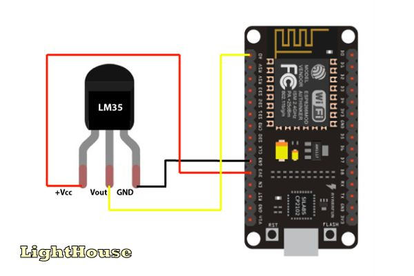

# iotcheck - nodemcu

This is a part of iotcheck application who is responsible for get temperature and 
humidity data from sensor and send to the api

# :pushpin: Table of Contents

* [ESP8266 Model](#clipboard-database-model)
* [Installation](#construction_worker-installation)
* [Getting Started](#runner-getting-started)

# :clipboard: ESP8266 Model

In order to understand the entities, I've created the following database model:



# :construction_worker: Installation

**This project was developed whit [PlatformIO](https://platformio.org/), but you're able to execute it on an Arduino IDE**


```
git clone https://github.com/cunhaedu/iotcheck-nodemcu.git
```

Create your environment variables based on the examples of ```config.example.h```

```
cp src/config.example.h src/config.h
```

# :runner: Getting Started

Before you execute the project is important that you have your iotcheck-api running in your machine
